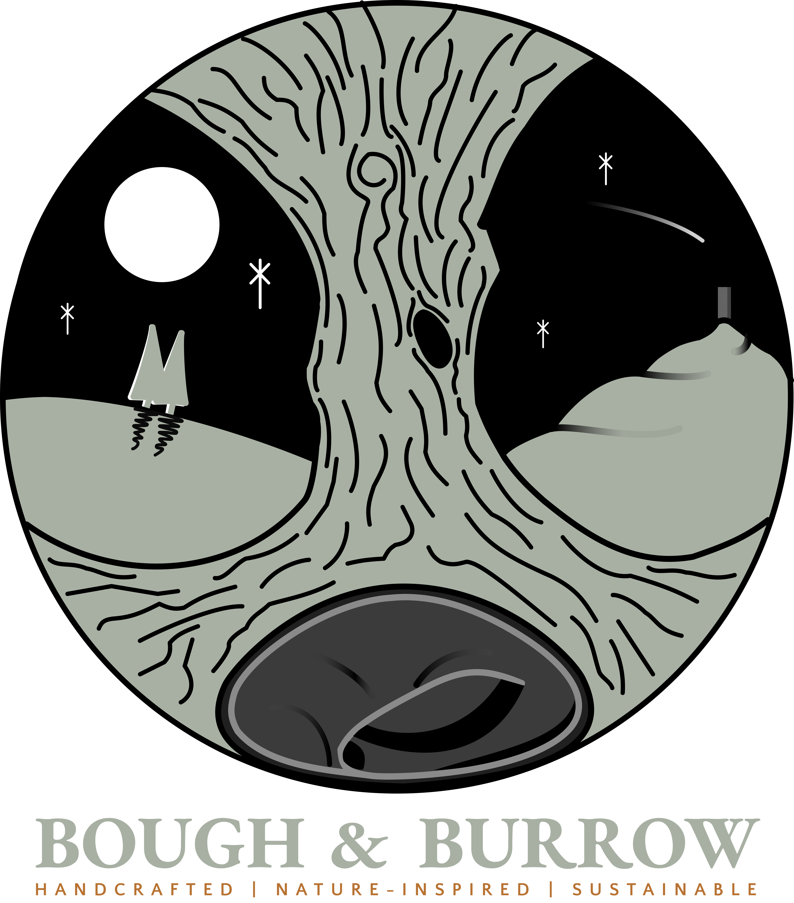
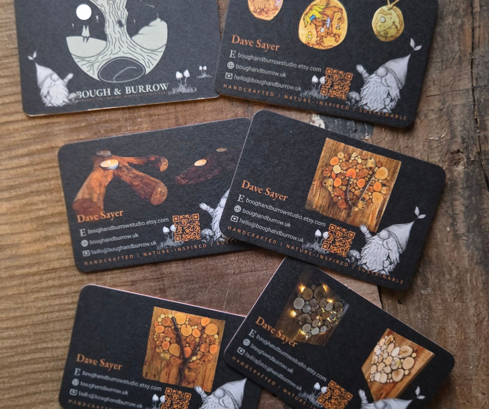
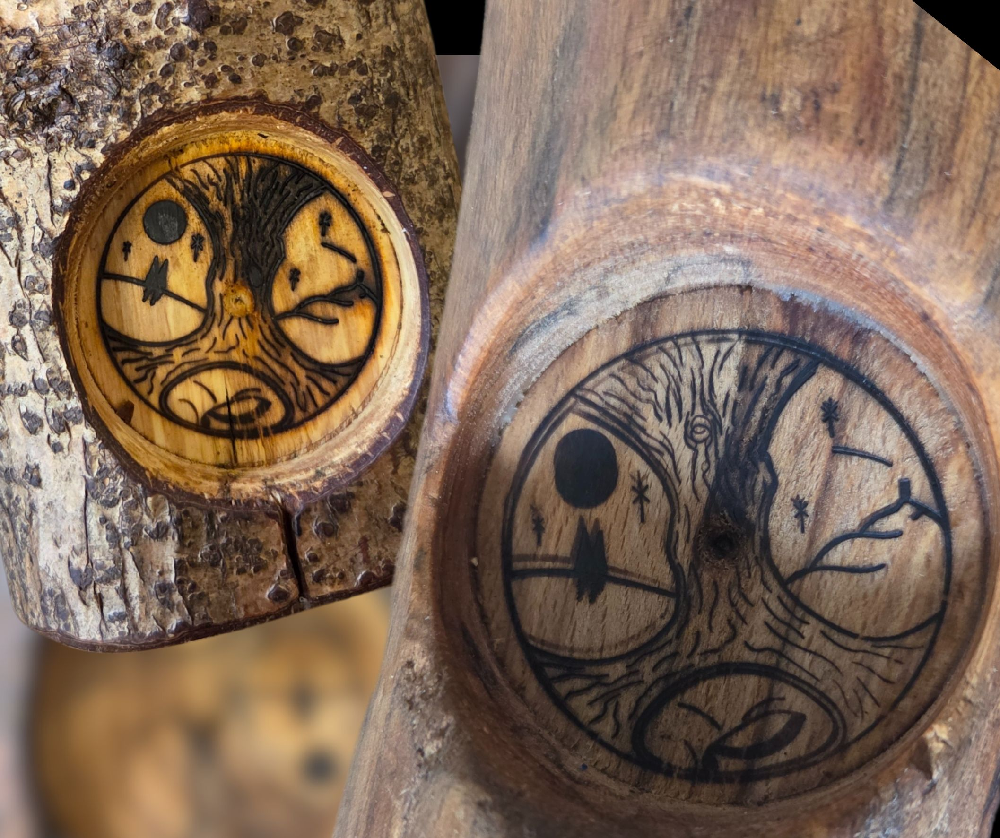
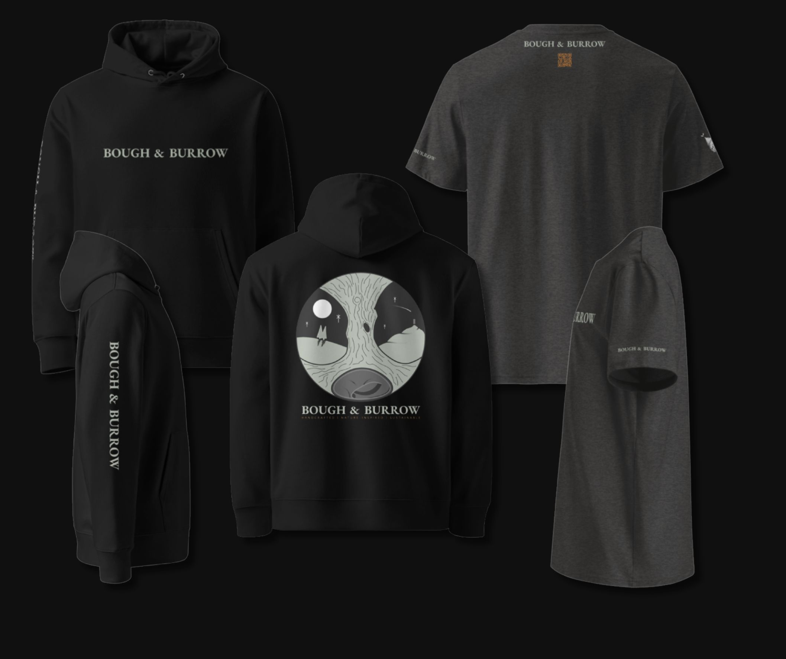

I set up my own crafting business early 2025 after years of on and off tinkering with reclaimed and salvaged materials and was obviously in need of a brand; a logo, business cards, domain name, etc, etc followed.

First came the name — something that resonated with who I am, what I create, and what matters to me. After mulling over ideas, I came up with Bough & Burrow — the bough of a tree, the burrow of a badger. The 'Bough' reflects the materials I work with; the 'Burrow' symbolises my studio, my creative world, and the care I pour into my work.

Next came the logo. It needed to represent not just my business, but the soul behind it — me. It features a strong tree, specifically an oak, as the central focus. I've always loved oak trees and the scent of oak wood is wonderful. I also have a soft spot for badgers, so a sleeping badger curls up in a burrow beneath the tree.

The design began as a sketch in my art pad. I then imported it into Figma, traced it with vector paths, and tweaked it until I was completely happy.

Once i was content with the logo, I began working on the business card designs. Using some of my sketches to add a touch of whimsy to the cards and a QR code which gives anyone scanning it 15% off in my Etsy store ([https://bghbrrw.uk/etsy](https://bghbrrw.uk/etsy)). URL shortening and QR codes are provided by the excellent Short.io which is an awesome service. The cards were printed by Moo.com and have turned out wonderfully.

I also had a custom branding iron made with my logo so i can brand my products.

I've also designed some merch -- two t-shirt designs and a hoody. One design has a QR code that gives the user 15% off in my Etsy store.

[Bough & Burrow on Etsy](https://bghbrrw.uk/etsy) (15% off store wide). Email <a href="mailto:hello@boughandburrow.uk">hello@boughandburrow.uk</a> for more info.
