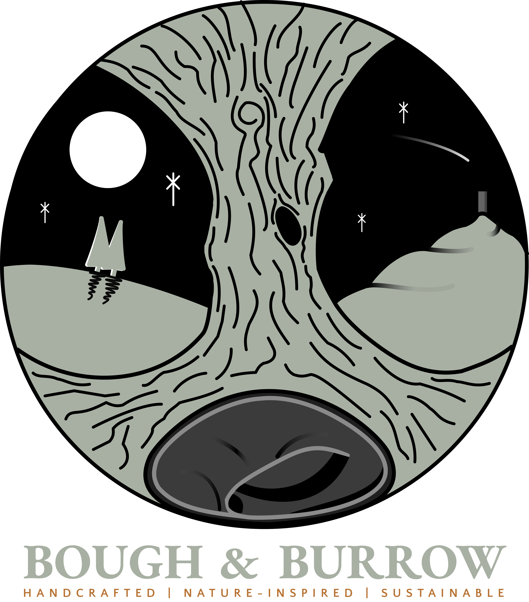
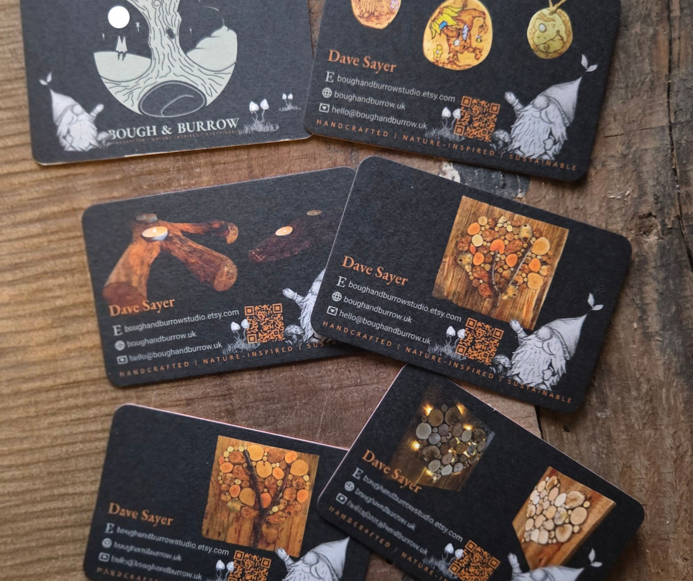
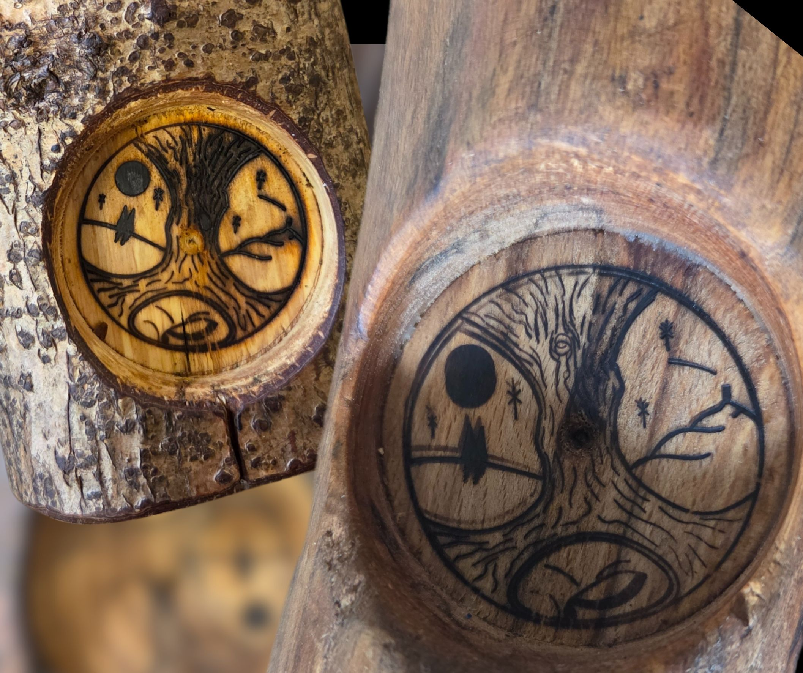

I set up my own crafting business early 2025 after years of on and off tinkering with reclaimed and salvaged materials and was obviously in need of a brand; a logo, business cards, domain name, etc, etc followed. First came the name, something that resonated with who I am, what I create and what is important to me. After some mulling of ideas, I came up with Bough & Burrow - The bough of a tree, the burrow of a badger. The Bough part relates to my materials while the burrow symbolises my studio and my heart...where i feel at home.

Next came the logo. It had to represent my business but also the heart behind the business -- Me. It features a strong tree, an oak to be specific, as the main focal point. I've always had a love of badgers, so a badger slumbers in a burrow beneath the tree. We have a full-moon and shooting star over Glastonbury Tor, a huge part of my late teens - I grew up with a view of the Tor out of my bedroom window. although I viewed it from the west and in the logo, it is seen from the south. Initially sketched in my art pad, imported to Figma then overlaying vector paths on my sketch and tweaking until i was 100% happy.

Once i was content with the logo, I began working on the business card designs. Using some of my sketches to add a touch of whimsy to the cards and a QR code which gives anyone scanning it 15% off in my etsy store ([https://bghbrrw.uk/etsy](https://bghbrrw.uk/etsy)). URL shortening and QR codes are provided by the excellent Short.io which is an awesome service. The cards were printed by Moo.com and have turned out wonderfully.

I've also had a custom branding iron made with my logo so i can brand my products.

