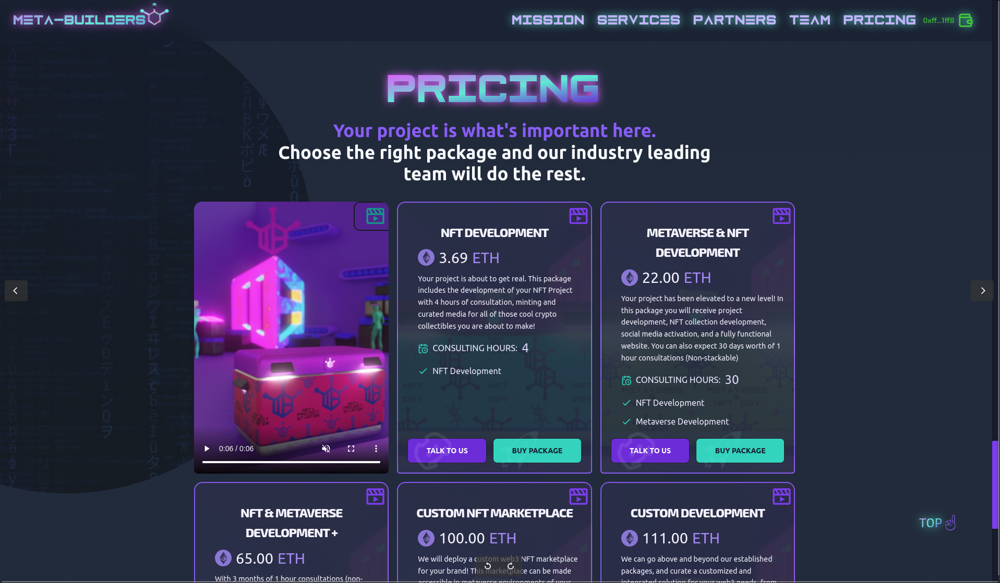

I led the design and development of the Meta-Builders website—a marketing platform for a Web3 agency and a global community of skilled freelancers, from project managers to illustrators, designers and developers operating in the blockchain, NFT and Metaverse space.

The goal was to create a clean, modern, and responsive site that clearly conveyed the brand’s ethos and service offerings, while integrating Web3 functionality to support service purchases as NFTs.

Built with Vite, React, TypeScript, ThirdWeb and TailwindCSS, the site delivers a fast and fluid user experience across all devices. It is deployed on Vercel for scalable performance. Blockchain functionality was implemented using opensource smart contracts and APIs, allowing users to mint and manage service-based <abbr title="Non-Fungible Token">NFT</abbr>s (Non-fungible tokens) directly on the Ethereum blockchain.

Adding the Web3 integration was made much easier by using the excellent modular smart contracts and <abbr title="Software Devlopment Kit">SDK</abbr>s provided by [Thirdweb](https://thirdweb.com/). Most of the ThirdWeb contracts are security audited for vulnerabilities and security issues by trusted third-party organisations such as CertiK, Macro and Chainsafe. We selected the most suitable contracts and I integrated the purchasing functionality using the Web3 wallet and smart contract SDKs.

3D Artwork and animation for the homepage and the NFTs was provided by b0gie, a freelancer in the 3D and Metaverse space and member of Meta-Builders core team.

> Dave did an amazing job on the Meta-Builders website. He displayed great professionalism and skill throughout the entire process. They were timely and efficient in their work, delivering the completed project on schedule and meeting all of the project requirements.
>  
>Throughout the project, Dave was highly responsive and communicative, keeping us informed of their progress every step of the way. They also provided valuable insights and suggestions that helped to enhance the final product.
>   
> I highly recommend Dave as a freelancer developer. Their skills and professionalism are outstanding, and they are a pleasure to work with. If you're looking for a talented and reliable developer, look no further than Dave.
> --<cite>Mike Smart, Meta-Builders</cite>