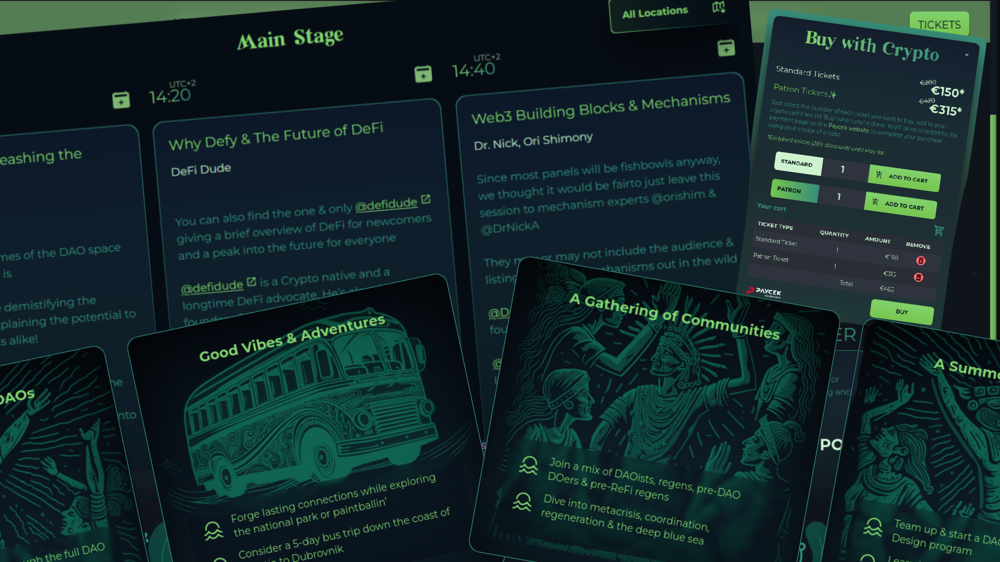

Built and deployed the official website for MetaFest: Croatia, a Web3 community event hosted by MetaGame DAO in Pula, Croatia. The site was developed using AstroJS, TailwindCSS, Node.js and React Three Fiber.

Optimised for speed, the website leveraged Astro's built-in image optimisation and multiple image formats, producing statically generated pages that load instantly for users, unlike server- or client-rendered content generated on the fly.

To support a dynamic and evolving schedule, I integrated the Google Calendar API via a custom Node.js backend, hosted securely on an encrypted remote server and managed with PM2. The backend fetched updated schedule data every minute, automatically triggering a rebuild and redeploy of the static frontend. This approach kept the site fully up-to-date, stayed within deployment allowances, and ensured attendees always had the latest speaker and event information.

The beautiful site was designed by Trolleo who works as a craft beer packaging designer. During the build we needed to add in a number of features not included in the original designs so I took on the task of designing them within the bounds of the original design.

The site also featured a hybrid traditional and crypto e-commerce integration: attendees could purchase tickets either via a Croatian card processor (PayCek) or with cryptocurrency through a Web3 wallet connection. Both flows were designed to deliver a consistent, user-friendly experience across payment methods.
