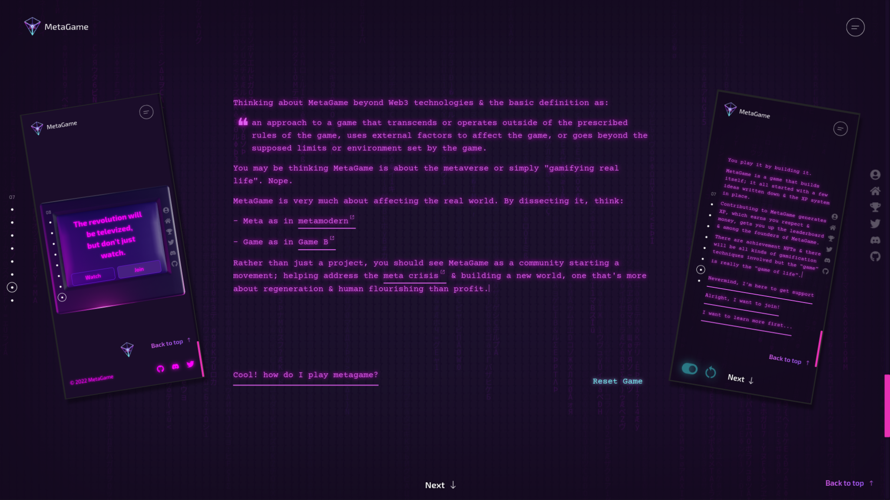
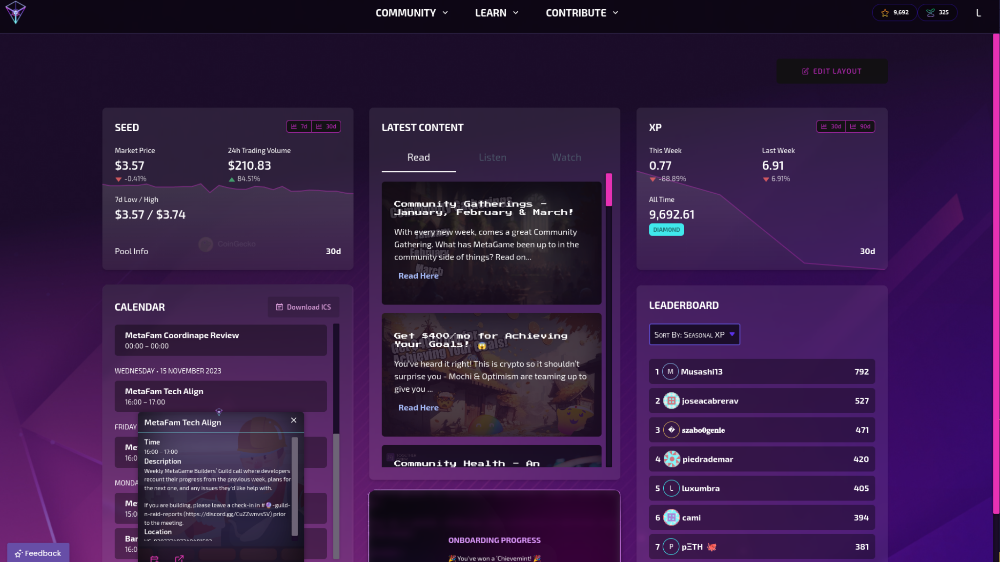

MetaGame is a decentralized Web3 community project that blended Web3 onboarding, social coordination, and economics with game-like mechanics to build a new socioeconomic system.

## My Role & Contributions
I contributed to frontend development and design for several key areas, including the onboarding experience, visual style, and community tools. I was also a core contributor in the community for 3 years and made it to 3rd position on the leaderboard, based on my contributions to the application and the DAO community.

## Frontend Development & Design
My contributions included improving layout, styling and accessibility across pages, refactoring React components, and helping maintain visual consistency. I also worked on the dashboard, the onboarding game and collaborated with other contributors on content structure and was the maintainer on the MetaGame wiki. The dashboard was a modular, user-friendly interface for community members to track their contributions, achievements, community calendar and progress within the MetaGame ecosystem.

## Code Reviews & Open Source Maintenance
Over the three years I was involved with MetaGame, I contributed to thier open-source ecosystem by supporting frontend code quality and consistency across community-contributed pull requests. As a GitHub org admin, I reviewed and merged PRs, particularly those affecting the UI, ensuring changes followed brand guidelines and semantic HTML practices. I helped maintain usability and design integrity by guiding contributors away from overly generic component usage and toward accessible, meaningful markup.

## DAO Treasury Management
I was also a multisig signer for the DAO treasury and was responsible for the monthly 'payroll' process, called TheMint, where I'd run scripts on the XP repository to calculate how much of our token contributors earned based on their contributions, and then distribute the project's tokens to contributors' wallets. This process was crucial for maintaining the economic model of the community and ensuring fair compensation for contributors.

## Project Legacy
The project was fully open-source and driven by a global contributor network (all corners of the world) but sadly, the project didn't survive the bear market. However many projects were spawned from it, formed by community members who went on to build their own Web3 projects. A number of the core team are now running [dAcademy](https://dacade.my) (Web3 onboarding & Education), [NextMeta](https://metagame.substack.com/) (Podcast & Newsletter) and MetaFest (Events & Conferences).

The wiki is still live if you'd like to learn more about the project: [MetaGame Wiki](https://wiki.metagame.wtf/)
