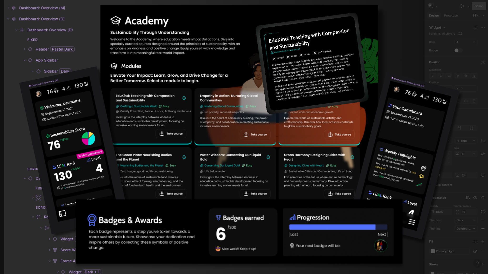

Contracted to lead the UX and UI design for a sustainability-focused web app aimed at both individuals and corporate users. The app was designed to gamify carbon reduction and eco-conscious decision-making, with tailored user journeys for different user types.

Over the course of the project, I worked in Figma and FigJam to deliver:

  - User flows and interaction diagrams
  - User stories
  - Wireframes and page layouts
  - High-fidelity visual designs with modular components

The interface was designed to be clean, accessible, and modern, with clear incentives and feedback loops for both casual users and enterprise-level sustainability reporting and featured illustrations created by another team member. While the project ultimately did not proceed to development, the full UX and visual design system was completed and handed off for implementation.
