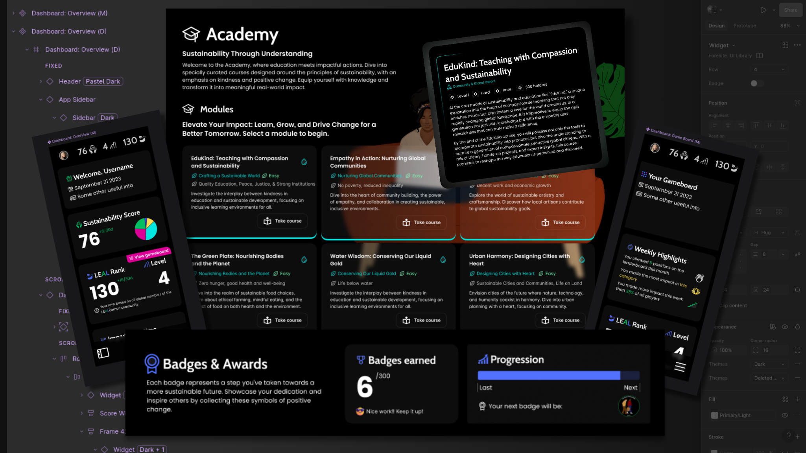

I was contracted to lead the UX and UI design for a sustainability-focused web application aimed at helping both individuals and businesses make more eco-conscious decisions. The app's concept centred around gamifying carbon reduction, encouraging users to engage with sustainability goals through clear incentives and actionable feedback.

## Design Process
My role covered the entire design process, from early discovery through to a fully-developed design system, using Figma and FigJam throughout. I collaborated closely with stakeholders to map out user journeys tailored to different audience segments — from casual users looking to track personal impact, to enterprise users requiring detailed sustainability reporting.

## Key Deliverables

- Detailed user flows and interaction diagrams to map out user behaviour and app logic
- Comprehensive user stories to capture requirements and guide feature design
- Low- and high-fidelity wireframes to iterate on layout and functionality
- High-fidelity visual designs, built around a modular component system for consistency and scalability
- To streamline the workflow and ensure maintainability, I created a reusable component library within Figma, which allowed for more efficient design updates and easier handoff to development.

## Outcome
The interface was crafted to be clean, accessible, and highly usable, blending clear visual hierarchy with engaging illustrations (created by a collaborating designer) to support the app's mission. Although the project ultimately did not move forward into development, a complete UX strategy, full visual design system, and developer-ready design assets were successfully delivered and prepared for potential future implementation.
