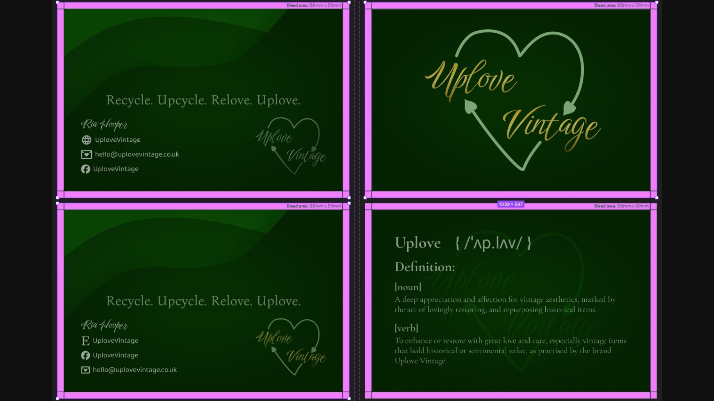

Uplove Vintage is a small independent seller specialising in curated vintage glassware, jewellery, and collectibles. With a brand ethos rooted in sustainability and sentimentality, they promote the values of “Recycle. Upcycle. Relove. Uplove.”

I worked closely with the founder, Ria, to deliver a cohesive and evocative visual identity that reflects the brand’s core message of love for vintage and sustainability.

### Deliverables
#### Logo Design
Developed a custom logo combining elegant script typography with a heart-shaped recycle motif, symbolising the ‘uplove’ philosophy—restoring and reloving vintage pieces with care.

#### Business Card Design
Designed multiple versions of double-sided business cards, each featuring a rich, deep green palette and gold-accented typography to evoke a sense of heritage and elegance. The cards include contact details, social handles, and a custom definition of the coined term “Uplove” for memorable branding.

#### Domain Name and Email
Registered the uplovevintage.co.uk domain (as a reseller) for them and configured the domain to use encrypted, privacy focussed [Proton Mail](https://proton.me/business) for on-brand email addresses.

#### Merch Concepts
Produced visuals and layouts for merchandise including eco-friendly t-shirts & hoodies and future packaging labels, tote bags, and thank-you cards, all maintaining brand consistency and supporting the upcycled aesthetic.

### Outcome
The client now has a fully-formed brand identity that communicates both emotional warmth and environmental consciousness. The business cards and merchandise are being used at in-person vintage fair increasing brand recognition and customer engagement.

You can check out Uplove's wonderful vintage items in thier Etsy store [https://uplovevintage.etsy.com](https://uplovevintage.etsy.com) or say Hi on their socials--search UploveVintage on Insta or Facebook.
